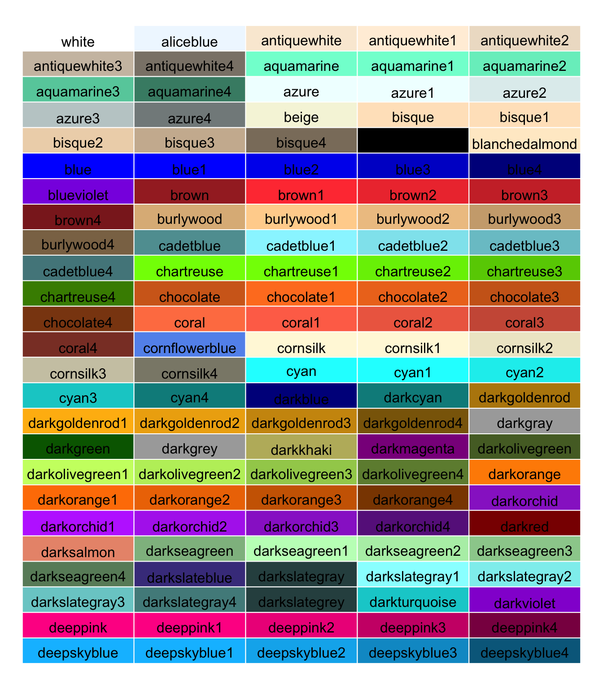

```{r setup, include=FALSE}
knitr::opts_chunk$set(echo = TRUE)
```

## ¿Qué es `ggplot2`?

`ggplot2` es un **paquete para generar gráficos en R**; pertenece a `tidyverse`, una familia de paquetes orientados a facilitar el análisis de datos en R.

### ¿Qué tiene de especial `ggplot2`?

`ggplot2` no es el único paquete que hay para generar gráficos en R. De hecho, ni siquiera viene incluido por defecto en R, es decir, el usuario tiene que instalarlo por medio de `install.packages` (`graphics` es el paquete predeterminado para generar gráficos en R).

Entonces, ¿cuál es todo el lío al rededor de este paquete? `ggplot2` es la implementación en R de un libro escrito por Leland Wilkinson cuyo título es [_The Grammar of Graphics_](https://libgen.is/book/index.php?md5=99DA56D01298A37D359C67BC71479FE0) (1999). El argumento principal de Wilkinson es que, como en cualquier otra ciencia o disciplina, aquellos que se dedican a hacer y estudiar gráficos necesitan un lenguaje para nombrar, describir y comunicar su objeto de estudio. Así, Wilkinson introdujo todo **un vocabulario y reglas (una gramatica) que permiten describir sistematicamente un gráfico**. Además, Wilkinson **propuso que el proceso ideal para crear un gráfico es, simplemente, describiendo el resultado final**: con la ayuda del vocabulario especializado de _The Grammar of Graphics_, uno puede ir describiendo los bloques que constituyen el gráfico final.

`ggplot2` permite usar en R el sistema que planteó Wilkinson en _The Grammar of Graphics_. Este sistema facilita enormemente la generación de gráficos para visualizar datos. En consecuencia, podemos recurrir más fácil y frecuentemente a esta herramienta para **explorar nuestros datos y comunicar nuestros hallazgos**. En comparación con otros paquetes e, incluso, con otros idiomas de programación, `ggplot2` hace mucho en muy poquitas líneas de código. Además, es sumamente flexible y casi cualquier parte del gráfico puede ser modificada, permitiéndonos crear gráficos "bonitos".

### Algunos ejemplos

Por las razones descritas arriba, `ggplot2` se convirtió en la punta de lanza en la visualización de datos y su uso es bastante generalizado entre la comunidad "datera". Aquí les dejo unos ejemplos de los productos que se pueden generar usando este paquete para R.

#### Demografía regional suiza (_Schweizer Radio und Fernsehen_)


#### Evolución de la pandemia de coronavirus (_Financial Times_)

Así es, en `ggplot2` es posible crear animaciones.


#### Cobertura mediatica y opinión pública (_FiveThirtyEight_)


## ¿Cómo usar `ggplot2`?

Como ya vimos arriba, la idea fundamental del sistema de _The Grammar of Graphics_ es que para hacer un gráfico, simplemente **vamos a ir describiendo los elementos que queremos estén en nuestro resultado final**. Ahora bien, la manera en que vamos a ir describiendo este resultado final, sin embargo, no es arbitraria y sigue un par de reglas.

Primero, vamos a inicializar un objeto `ggplot`. Piensa que este es, simplemente, un lienzo en blanco sobre el cual vamos a dibujar nuestro gráfico. 

Después, **vamos a modificar el `ggplot` (nuestro lienzo en blanco) agregando capas de información**. La forma más básica de agregar una nueva capa de información es **asociando variables de nuestra base de datos a características estéticas (visuales) de un objeto geométrico**.


A continuación veremos cómo se ve este proceso usando código en R.

### Inicializar un objeto `ggplot`

Antes de iniciar, necesitamos cargar el paquete `ggplot2` en memoria:

```{r load_ggplot2}
library(ggplot2)
```

Ahora, como vimos arriba, el primer paso en la generación de nuestros gráficos es inicializar un objeto `ggplot`: nuestro lienzo en blanco para empezar a dibujar. Para esto, usamos la función `ggplot`.

```{r init_ggplot}
# Inicializar un objeto ggplot y guardarlo en 'mi_plot'
mi_plot <- ggplot()
```

Si escribimos el nombre de un objeto `ggplot2` en la consola de RStudio, podemos ver su contenido.

```{r view_ggplot}
mi_plot
```

Como podrás ver, `mi_plot` es un ubjeto `ggplot` vacío. No hemos agregado capas de información y, por lo tanto, sólo vemos un cuadro color gris.

Antes de continuar, vamos a generar algunos datos aleatorios para que tengamos algo que graficar. **No es importante que entiendas perfectamente el código que está aquí abajo**, sólo está para tener algunos datos con los cuales dibujar algunos ejemplos. Básicamente creé una tabla con 10 000 observaciones y cinco variables: \(x_0, x_1, x_2, x_3, y\). Las primeras dos son una [distribución normal](https://en.wikipedia.org/wiki/Normal_distribution), \(x_2\) es una [distribución uniforme](https://en.wikipedia.org/wiki/Uniform_distribution_(continuous)), \(x_3\) es una variable categórica e `y` se genera con la fórmula \(y = x_0 + 3.5x_1 + 4.5 x_2\).

```{r gen_data, message=FALSE, warning=FALSE}
# Definimos semilla para generador de números aleatorios
set.seed(123456789) 

# Cargamos el tidyverse
library(tidyverse)

# Crear una tabla con datos aleatorios
datos <- tibble(
  # Distribución normal, 10'000 obs, m = 0, sd = 2.
  x0 = rnorm(10000, 0, 2),
  # Distribución normal, 10'000 obs, m = 5, sd = 1.
  x1 = rnorm(10000, 5, 1),
  # Distribución uniforme, 10'000 obs, min = 0.1, max = 0.9
  x2 = runif(10000, 0.1, 0.9),
  # Variable categórica: 4 grupos de exactamente el mismo tamaño
  x3 = rep(c("Grupo A", "Grupo B", "Grupo C", "Grupo D"), 10000/4),
  # Una variable construida a partir de otras variables
  y = x0 + 3.5 * x1 + 4.5 * x2
)
```

### Agregar capas

#### Objetos geométricos

Una vez inicializado el objeto `ggplot`, podemos empezar a agregar capas de información. Recuerda que esto se hace **asociando variables de nuestra base de datos a características estéticas (visuales) de un objeto geométrico**.

Si quisieramos crear un [diagrama de dispersión](https://en.wikipedia.org/wiki/Scatter_plot) para ver cómo se relacionan las variables \(x_0\) e \(y\) escribiríamos el siguien código:

```{r plot point}
# Generar gráfico
mi_plot <- ggplot() + 
  # Agregar capa de puntos
  geom_point(data = datos, mapping = aes(x = x0, y = y))

# Ver el gráfico
mi_plot
```

En la primer línea, estamos inicializando un objeto `ggplot` vacío con la función `ggplot()`. Posteriormente, le estamos diciendo a R que agregue una nueva capa con el símbolo de adición `+`. En la segunda línea usamos la función `geom_point` para indicar que estamos agregando una nueva figura geométrica: puntos. 

Dentro de `geom_point` estamos definiendo dos parámetros: `data` y `mapping`. Con el parámetro `data` podemos especificar **qué datos vamos a usar** para dibujar la figura geométrica. En este caso, estamos usando `datos`, la tabla que definimos más arriba con un puñado de datos generados al azar. Con el parámetro `mapping` estamos especificando **la relación entre las variables de nuestros datos y las características estéticas del objeto geométrico**. En `ggplot2` siempre vamos a usar la función `aes` para definir el parámetro `mapping`. En el ejemplo, escribimos `mapping = aes(x = x0, y = y)`, indicando que la posición en el eje vertical de cada punto va a estar dada por la variable \(y\) y la posición en el eje horizontal de cada punto va a estar dada por la variable \(x_0\).

`aes` es la abreviación de `aesthetics`.


Retomando el diagrama de aquí arriba, estamos asociando la información en `datos` con dos propiedades estéticas (posición `x` e `y`) de una figura geométrica (en este caso unos puntos).

Podemos agregar otros parámetros estéticos. En este caso, podemos asociar el color de cada punto (parámetro `colour`) con la variable \(x_3\), una variable categórica con cuatro niveles: Grupo A, Grupo B, Grupo C y Grupo D. Así, cada puntito recibirá un color distinto en función del grupo al que fue asignado.

```{r plot point with color}
# Generar gráfico
mi_plot <- ggplot() + 
  # Agregar capa de puntos (con colores)
  geom_point(data = datos, mapping = aes(x = x0, y = y, colour = x3))

# Ver el gráfico
mi_plot
```

Ahora bien, **no todas las propiedades estéticas de un objeto tienen que estar asociadas a nuestras bases de datos**. En el ejemplo que estamos usando, podemos definir un nivel de transparencia (parámetro `alpha`) arbitrario para nuestros puntos.

```{r plot point with color and non-aes alpha}
# Generar gráfico
mi_plot <- ggplot() + 
  # Agregar capa de puntos (con colores y transparencia)
  geom_point(data = datos, mapping = aes(x = x0, y = y, colour = x3),
             alpha = 0.2)

# Ver el gráfico
mi_plot
```

Nota cómo los atributos estéticos que no están asociados a alguna variable de nuestros datos se definen fuera de la función `aes`. En este caso, la transparencia (`alpha`) no está asociada a ninguna variable (es un número fijo) y está fuera de la función `aes`.

Incluso, también podríamos asignar un color arbitrario a los puntos sustrayendo el parámetro `colour` de la función `aes`.

```{r plot point with non-aes color and alpha}
# Generar gráfico
mi_plot <- ggplot() + 
  # Agregar capa de puntos (con colores y transparencia fuera de aes)
  geom_point(data = datos, mapping = aes(x = x0, y = y),
             colour = "royalblue", alpha = 0.2)

# Ver el gráfico
mi_plot
```

En este caso, le indiqué a `ggplot` que los puntos deben ser de color azul (`colour = "royalblue"`). En `ggplot2` **podemos especificar un color por su nombre o escribiendo su código HTML**. Acá abajo podrás ver una lista de los colores que puedes invocar por nombre en R. Si no estás familizarizado con los colores HTML, puedes leer (el artículo de wikipedia)[https://en.wikipedia.org/wiki/Web_colors] y, si necesitas generar códigos html para tus colores favoritos, a mi me gusta mucho usar (esta página)[http://tristen.ca/hcl-picker/#/hlc/6/1.02/33A2A9/EFEE66].



En el ejemplo de abajo, puedo hacer el mismo gráfico, pero en lugar de especificar el color por nombre, uso su código HTML:

```{r plot point with non-aes html color and alpha}
# Generar gráfico
mi_plot <- ggplot() + 
  # Agregar capa de puntos (con colores y transparencia fuera de aes)
  geom_point(data = datos, mapping = aes(x = x0, y = y),
             colour = "#4169e1", alpha = 0.2)

# Ver el gráfico
mi_plot
```

En `ggplot2` **podemos agregar más de una capa de objetos geométricos a nuestro gráfico**. En nuestro ejemplo, podemos agregar una línea de tendencia (_smoothing curve_)[http://geog.uoregon.edu/bartlein/old_courses/geog414f03/lectures/lec05.htm] con `geom_smooth` a nuestro gráfico de dispersión para tener una mejor idea de la correlación entre \(x_0\) e \(y\).

```{r plot point and smoothing }
# Generar gráfico
mi_plot <- ggplot() + 
  # Agregar capa de puntos (con colores y transparencia fuera de aes)
  geom_point(data = datos, mapping = aes(x = x0, y = y),
             colour = "royalblue", alpha = 0.2) +
  # Agregar capa con línea de tendencia
  geom_smooth(data = datos, mapping = aes(x = x0, y = y),
             colour = "brown2", method = "loess")

# Ver el gráfico
mi_plot
```

`geom_smooth` calcula la mejor fórmula que describe los datos y, con base en esta, dibuja la línea de tendencia. En este caso, con la curva podemos ver, con mucha mayor claridad, la relación entre \(x_0\) e \(y\): a mayor valor de \(x_0\), mayor valor en \(y\).

Por favor también nota que en `geom_smooth` agregamos un nuevo parámetro: `method`. Hay figuras geométricas que **admiten parámetros especiales**. En este caso, `geom_smooth` admite el parámetro `method`, el cual sirve para especificar el método matemático para estimar la linea de tendencia.

Ahora bien, **no todos los objetos geométricos en `ggplot2` pueden representar espacialmente dos variables** (mediante los parámetros estéticos `x`, `y`). En `ggplot2` hay un grupo de objetos geométricos un tanto especiales que **dibujarán una representación gráfica de la densidad de la variable especificada en el parámetro `x` de `aes`**. Estos objetos geométricos son `geom_histogram`, `geom_density`, `geom_dotplot` y `geom_freqpoly`.

Recuerda que la densidad de una variable nos dice **qué intervalos de los datos son más frecuentes y cuáles menos frecuentes**.

```{r plot histogram }
# Generar gráfico
mi_plot <- ggplot() + 
  # Agregar capa con histograma
  geom_histogram(data = datos, mapping = aes(x = x0),
                 colour = "royalblue", fill = "royalblue", alpha = 0.7)

# Ver el gráfico
mi_plot
```

Nota que, en este caso, estamos introduciendo un nuevo parámetro estético: `fill`. El parámetro `fill` sirve para especificar el color de relleno de una figura geométrica.

De hecho, si intentamos especificar `x` e `y` en `geom_histogram`, `ggplot2` responderá con un error, pues **la función sólo acepta el parámetro cartesiano `x`**.

```{r plot histogram with error, error=TRUE}
# Generar gráfico
mi_plot <- ggplot() + 
  # Intentar agregar una capa de histograma (con parámetros x y)
  geom_histogram(data = datos, mapping = aes(x = x0, y = y),
                 colour = "royalblue", fill = "royalblue", alpha = 0.7)

# Ver el gráfico
mi_plot
```

A pesar de esta limitación, es posible visualizar interacciones con otras variables en la misma capa. Particularmente, **podemos ver cómo se distribuye una variable en distintos grupos**. En nuestro ejemplo, podemos usar el parámetro `group` en la función `aes` para indicarle a `ggplot2` que nuestra variable \(x_0\) puede ser dividida en los grupos especificados en \(x_3\) (recuerda que \(x_3\) era una variable categórica con cuatro niveles: Grupo A, Grupo B, Grupo C y Grupo D).

```{r plot grouped density curves }
# Generar gráfico
mi_plot <- ggplot() + 
  # Agregar capa con curvas de densidad divididas por grupos
  geom_density(data = datos, mapping = aes(x = x0, group = x3, colour = x3))

# Ver el gráfico
mi_plot
```

En el ejemplo de arriba, los cuatro grupos parecen distribuirse de manera identica, pues sus curvas de densidad son muy parecidas.

También podemos combinar este tipo de objetos geométricos en varias capas.

```{r plot multiple densities }
# Generar gráfico
mi_plot <- ggplot() + 
  # Agregar capa con curvas de densidad divididas por grupos: variable x_1
  geom_density(data = datos, mapping = aes(x = x1, group = x3), colour = "brown2") +
  # Agregar capa con curvas de densidad divididas por grupos: variable x_0
  geom_density(data = datos, mapping = aes(x = x0, group = x3), colour = "royalblue") 

# Ver el gráfico
mi_plot
```

En este ejemplo, podemos ver que, aún cuando dividimos las variables por grupos, las variables \(x_1\) y \(x_0\) **no se distribuyen de manera igual**, pues la primera (en azul) parece concentrarse al rededor del 0 (cero), mientras que la segunda (en rojo) parece concentrarse al rededor del 5.

#### Facetas

Otra de las capas que podemos aregar a un objeto `ggplot` es una **faceta**. Una capa de facetas dividirá el gráfico en una serie de subgráficos en función de una variable en nuestros datos.

En el ejemplo que hemos estado trabajando, podemos agregar una faceta con `facet_grid` o `facet_wrap`.

```{r plot facet_wrap}
# Generar gráfico
mi_plot <- ggplot() + 
  # Agregar capa de puntos (con colores y transparencia fuera de aes)
  geom_point(data = datos, mapping = aes(x = x0, y = y),
             colour = "royalblue", alpha = 0.2) +
  # Agregar capa con línea de tendencia
  geom_smooth(data = datos, mapping = aes(x = x0, y = y),
             colour = "brown2", method = "loess") +
  # Agregar capa de facetas para dividir en subgráficos
  facet_wrap(~ x3)

# Ver el gráfico
mi_plot
```

En este caso, estamos indicando a `ggplot2` que divida nuestro gráfico en función del contenido de la función \(x_3\): Grupo A, Grupo B, Grupo C, Grupo D. Esta podría ser otra forma en la que podríamos comparar cómo se comportan dos variables entre grupos; en este caso, podemos ver que, entre los grupos A, B,C y D, la relación entre \(x_0\) e \(y\) es casi identica entre grupos.

Nota que en la función `facet_wrap` usamos el símbolo de tile (`~`). En las funciones de facetas (todas tienen el prefijo `facet_`), se usa una notación especial para definir cómo dibujar los subgráficos: imagina que **los subgráficos se van a dibujar en una tabla, entonces vamos a especificar cuántas filas y cuántas columans va a tener esa tabla de subgráficos con la notación `filas ~ columnas`**.

En nuestro ejemplo, le estamos diciendo a `ggpplot2` que cree columnas de subgráficos con base en la variable \(x_3\) (Grupo A, Grupo B, Grupo C, Grupo D): `facet_wrap(~ x3)`. Ahora bien, lo especial de `facet_wrap`, es que `ggplot2` reacomoda esas columnas en función del espacio disponible, por eso, vemos una tabla con dos columnas y dos filas.

Si en lugar de `facet_wrap` usamos `facet_grid`, podemos ver el comportamiento original: habrá cuatro columnas, pero estarán un poco amontonadas.

```{r plot facet_grid}
# Generar gráfico
mi_plot <- ggplot() + 
  # Agregar capa de puntos (con colores y transparencia fuera de aes)
  geom_point(data = datos, mapping = aes(x = x0, y = y),
             colour = "royalblue", alpha = 0.2) +
  # Agregar capa con línea de tendencia
  geom_smooth(data = datos, mapping = aes(x = x0, y = y),
             colour = "brown2", method = "loess") +
  # Agregar capa de facetas para dividir en subgráficos
  facet_grid(. ~ x3)

# Ver el gráfico
mi_plot
```

De hecho, también podríamos decirle a `ggplot` que queremos que los subgráficos se acomoden en filas, en lugar de columnas. Para hacerlo, sólo tendríamos que cambiar la posición de la tilde (recuerda que usamos la notación `filas ~ columnas`).

```{r plot facet_grid rows}
# Generar gráfico
mi_plot <- ggplot() + 
  # Agregar capa de puntos (con colores y transparencia fuera de aes)
  geom_point(data = datos, mapping = aes(x = x0, y = y),
             colour = "royalblue", alpha = 0.2) +
  # Agregar capa con línea de tendencia
  geom_smooth(data = datos, mapping = aes(x = x0, y = y),
             colour = "brown2", method = "loess") +
  # Agregar capa de facetas para dividir en subgráficos
  facet_grid(x3 ~ .)

# Ver el gráfico
mi_plot
```

#### Etiquetas

Seguro has notado que, conforme fuimos agregando capas, `ggplot2` fue etiquetando automaticamente la información que agregamos. En el último ejemplo, el eje vertical está rotulado con el texto 'y', mientras que el eje horizontal con 'x0', de manera que sabemos que la posición de cada punto, así como la linea de tendencia, están relacionadas con las variables \(x_0\) e \(y\).

Lo mismo ocurrió con el ejemplo en el que usábamos el parámetro `colour` y `group` dentro de la función `aes`. Podrás notar que `ggplot2` automaticamente agregó un rótulo para saber que los colores de las curvas estaban dados por el contenido de la variable \(x_3\).

```{r plot grouped density curves 2, echo=FALSE}
# Generar gráfico
mi_plot <- ggplot() + 
  # Agregar capa con curvas de densidad divididas por grupos
  geom_density(data = datos, mapping = aes(x = x0, group = x3, colour = x3))

# Ver el gráfico
mi_plot
```

La mayor parte del tiempo cambiaremos las etiquetas generadas automaticamente por `ggplot2`. Podemos hacerlo con la función `labs` (abreviación de _labels_). En la función `labs` usaremos **pares conformados por características estéticas y las etiquetas que queremos asociar a dicha característica**: `caracteristica = "etiqueta"`. Retomando el ejemplo de aquí arriba, podemos cambiar la etiqueta en el eje vertical con el parámetro `y` y la etiqueta que marca el color de los grupos con `colour` (recuerda que `y` es la característica estética que define la posición de un objeto en el eje vertical, mientras que `colour` es la característica estética que define el color del contorno de un objeto geométrico).

```{r plot grouped density curves labs}
# Generar gráfico
mi_plot <- ggplot() + 
  # Agregar capa con curvas de densidad divididas por grupos
  geom_density(data = datos, mapping = aes(x = x0, group = x3, colour = x3)) +
  # Agregar etiquetas
  labs(y = "Densidad", colour = "Grupos")

# Ver el gráfico
mi_plot
```

En `labs` también podemos definir un **título, subtítulo y nota al pie para nuestro gráfico**. Esto con los parámetros `title`, `subtitle` y `caption`, respectivamente.

```{r plot grouped density curves labs title}
# Generar gráfico
mi_plot <- ggplot() + 
  # Agregar capa con curvas de densidad divididas por grupos
  geom_density(data = datos, mapping = aes(x = x0, group = x3, colour = x3)) +
  # Agregar etiquetas
  labs(y = "Densidad", colour = "Grupos",
       title = "Distribución de x0",
       subtitle = "División por grupos",
       caption = "Datos generados aleatoriamente.")

# Ver el gráfico
mi_plot
```

#### Temas

Otra de las capas que usaras frecuentemente en `ggplot2` son los temas. Al igual que las etiquetas, esta es una capa que no se relaciona directamente con los datos de tus bases de datos. Es una capa que agrega detalles estéticos. Los temas, específicamente, agregan paletas de colores y estilos gráficos al `ggplot` con el que estamos trabajando.

Las funciones que agregan una capa de tema tienen el prefijo `theme_`.

Nuevamente, retomando el ejemplo de arriba, podemos agregar un tema oscuro con la función `theme_dark`.

```{r plot grouped density curves labs theme}
# Generar gráfico
mi_plot <- ggplot() + 
  # Agregar capa con curvas de densidad divididas por grupos
  geom_density(data = datos, mapping = aes(x = x0, group = x3, colour = x3)) +
  # Agregar etiquetas
  labs(y = "Densidad", colour = "Grupos",
       title = "Distribución de x0",
       subtitle = "División por grupos",
       caption = "Datos generados aleatoriamente.") + 
  # Agregar tema oscuro
  theme_dark()

# Ver el gráfico
mi_plot
```

## Ejemplo: diamantes

El paquete `ggplot2` incluye varias bases de datos para practicar los básicos de la generación de visualizaciones. En este caso vamos a usar `diamonds`, una tabla que contiene los registros de venta de más de 53 000 diamantes en Estados Unidos. La tabla contiene 10 columnas:

1. `carat`: peso del diamante en quilates. Un quilate = 200g.
2. `cut`: calidad del corte. Una variable categórica con 5 niveles (Fair, Good, Very Good, Premium, Ideal).
3. `color`: calidad del color del diamante. Una variable categórica con 7 niveles (de la D a la J), donde J es el mejor y D el peor.
4. `clarity`: nivel de translucidez de un diamante. Una variable categórica con 8 niveles (I1 (mejor), SI2, SI1, VS2, VS1, VVS2, VVS1, IF (peor)).
5. `depth`: medida de qué tan alto es el diamante con relación a su largo y ancho.
6. `table`: diámetro de la mesa del diamante.
7. `price`: precio del diamante en dólares estadounidenses.
8. `x`: ancho del diamante en mm.
9. `y`: largo del diamante en mm.
10. `z`: alto del diamante en mm.

### Gráfico de dispersión: precio y peso

Hay una clara relación positiva entre el peso de un diamante y su precio de venta. Entre más pesado, más caro. Nota que en la función `ggplot` que crea el lienzo sobre el cual estamos dibujando nuestro gráfico puedo especificar los datos que voy a usar con el parámetro `data`. Así puedo evitar repetir `data` en cada capa que agrego.

```{r}
# Generar gráfico
price_carat <- ggplot(data = diamonds) + 
  # Agregar capa de puntos
  geom_point(aes(x = carat, y = price), colour = "#9285B2", alpha = 0.5) + 
  # Agregar etiquetas
  labs(x = "Peso (quilates)", y = "Precio (USD)",
       title = "¿Cómo se relaciona el precio de un diamante con su peso?") +
  # Tema
  theme_light()
  

# Ver el gráfico
price_carat
```

### Gráfico de dispersión con línea de tendencia: precio y peso

Una línea de tendencia nos ayuda a ver de mejor manera la relación entre precio y peso. La relación no es completamente lineal. Podrás ver que, pasado un cierto peso, el precio de los diamantes baja un poco. Esto probablemente se deba a que el peso no es la única variable que define el precio de un diamante.

```{r}
# Generar gráfico
price_carat <- ggplot(data = diamonds) + 
  # Agregar capa de puntos
  geom_point(aes(x = carat, y = price), colour = "#c8c8c8", alpha = 0.5) + 
  # Agregar línea de tendencia
  geom_smooth(aes(x = carat, y = price), colour = "#39C1C4") +
  # Agregar etiquetas
  labs(x = "Peso (quilates)", y = "Precio (USD)",
       title = "¿Cómo se relaciona el precio de un diamante con su peso?",
       subtitle = "Línea de tendencia estimada por GAM") +
  # Tema
  theme_light()
  

# Ver el gráfico
price_carat
```

### Gráfico de dispersión: precio y peso por tipo de corte

Podemos indicarle a `ggplot` que pinte cada punto dependiendo de la calidad del corte del diamante. Podrás ver que los puntitos morados (el peor tipo de corte) siempre parecen estar abajo de la distribución, mientras que los puntitos amarillos (el mejor tipo de corte), siempre aparecen hasta arriba. Entonces, además del peso, el tipo de corte también parece afectar el precio de un diamante.

```{r}
# Generar gráfico
price_carat <- ggplot(data = diamonds) + 
  # Agregar capa de puntos
  geom_point(aes(x = carat, y = price, colour = cut), alpha = 0.2) + 
  # Agregar etiquetas
  labs(x = "Peso (quilates)", y = "Precio (USD)",
       title = "¿Cómo se relaciona el precio de un diamante con su peso?",
       subtitle = "Por calidad de corte",
       colour = "Calidad del corte") +
  # Tema
  theme_light()
  

# Ver el gráfico
price_carat
```

### Gráfico de dispersión con líneas de tendencia: precio y peso

Podemos agregar una línea de tendencia por cada tipo de corte con el parámetro `colour` y `group` en `geom_smooth`. Así es un poco más fácil ver que el corte Fair se cotiza más barato que el corte Ideal.

```{r}
# Generar gráfico
price_carat <- ggplot(data = diamonds) + 
  # Agregar capa de puntos
  geom_point(aes(x = carat, y = price), colour = "#c8c8c8", alpha = 0.1) + 
  # Agregar línea de tendencia
  geom_smooth(aes(x = carat, y = price, colour = cut, group = cut)) +
  # Agregar etiquetas
  labs(x = "Peso (quilates)", y = "Precio (USD)",
       title = "¿Cómo se relaciona el precio de un diamante con su peso?",
       subtitle = "Líneas de tendencia por tipo de corte",
       colour = "Calidad del corte") +
  # Tema
  theme_light()
  

# Ver el gráfico
price_carat
```

### Gráfico de dispersión con líneas de tendencia: precio y peso por translucidez

¿Cómo afecta la translucidez la relación peso y precio? Parece que la translucidez tiene un efecto más claro sobre la relación precios y peso. Nota que, a diferencia de la variable `cut`, en este caso las líneas de tendencia no se amontonan entre más grande sea el peso.

```{r}
# Generar gráfico
price_carat <- ggplot(data = diamonds) + 
  # Agregar capa de puntos
  geom_point(aes(x = carat, y = price), colour = "#c8c8c8", alpha = 0.2) + 
  # Agregar línea de tendencia
  geom_smooth(aes(x = carat, y = price, colour = clarity, group = clarity)) +
  # Agregar etiquetas
  labs(x = "Peso (quilates)", y = "Precio (USD)",
       title = "¿Cómo se relaciona el precio de un diamante con su peso?",
       subtitle = "Líneas de tendencia por calidad de la translucidez",
       colour = "Calidad de translucidez") +
  # Tema
  theme_light()
  

# Ver el gráfico
price_carat
```

### Gráfico de dispersión y facetas: peso y precio por translucidez y corte.

Podríamos ver cómo interactúan, al mismo tiempo, el tipo de corte y la translucidez del diamante con la ayuda de facetas. Es interesante ver cómo, cuando el tipo de corte es el peor y la translucidez es la de peor calidad, el precio y el peso del diamante se comportan volatilmente. Es decir, el peso deja de ser un buen predictor del precio del diamante. 

```{r}
# Generar gráfico
price_carat <- ggplot(data = diamonds) + 
  # Agregar capa de puntos
  geom_point(aes(x = carat, y = price), colour = "#c8c8c8", alpha = 0.2) + 
  # Agregar línea de tendencia
  geom_smooth(aes(x = carat, y = price), colour = "#39C1C4") + 
  # Facetas. Filas: cut, columnas: clarity
  facet_grid(cut ~ clarity) +
  # Agregar etiquetas
  labs(x = "Peso (quilates)", y = "Precio (USD)",
       title = "¿Cómo se relaciona el precio de un diamante con su peso?",
       subtitle = "Interacciones entre translucidez y calidad del corte") +
  # Tema
  theme_light()
  

# Ver el gráfico
price_carat
```

### Histograma: distribución del precio

En nuestra base de datos, hay muchos casos que se concentran en un rango de precio bajo (se vendieron en menos de 2500 USD). 

```{r}
# Generar gráfico
price_dist <- ggplot(data = diamonds) + 
  # Agregar histograma
  geom_histogram(aes(x = price), colour = "#39C1C4", fill = "#39C1C4", alpha = 0.5) + 
  # Agregar etiquetas
  labs(x = "Precio (USD)", y = "Frecuencia",
       title = "¿Cómo se distribuye el precio de los diamantes vendidos?") +
  # Tema
  theme_light()
  

# Ver el gráfico
price_dist
```

### Diagrama de cajas: distribución del precio por tipo de corte

Vamos a ver cómo se distribuye el precio según la calidad del corte. Una de las figuras geométricas más útiles para visualizar la distribución de variables categóricas es `geom_boxplot`. Este _geom_ dibujará un [diagrama de caja](https://en.wikipedia.org/wiki/Box_plot) para cada una de las categorías en una variable continua. En este caso, le estamos pidiendo que dibuje la distribución de `price` entre las categorías de `cut`.

Podemos ver que el mejor tipo de corte (Ideal), curiosamente tiene la mediana más baja. Probablemente esto se debe a que los diamantes mejor cortados tienden a ser más pequeños y, por tanto, más baratos.

```{r}
# Generar gráfico
price_dist <- ggplot(data = diamonds) + 
  # Agregar diagrama de caja
  geom_boxplot(aes(x = cut, y = price, colour = cut, fill = cut), alpha = 0.5) + 
  # Agregar etiquetas
  labs(x = "Calidad del corte", y = "Precio (USD)",
       title = "¿Cómo se distribuye el precio de los diamantes vendidos?",
       subtitle = "Por calidad del corte",
       colour = "Calidad del corte", fill = "Calidad del corte") +
  # Tema
  theme_light()
  

# Ver el gráfico
price_dist
```

### Diagrama de cajas: distribución del precio por translucidez

Podemos hacer lo mismo con la translucidez. En este caso, la relación entre precio y la calidad de la translucidez es un poco más clara. IF (la peor calidad) tiene la mediana más baja, mientras que I1 (la mejor calidad) tiene uno de los primeros cuartiles y medianas más altos. 

```{r}
# Generar gráfico
price_dist <- ggplot(data = diamonds) + 
  # Agregar diagrama de caja
  geom_boxplot(aes(x = clarity, y = price, colour = clarity, fill = clarity), alpha = 0.5) + 
  # Agregar etiquetas
  labs(x = "Calidad del corte", y = "Precio (USD)",
       title = "¿Cómo se distribuye el precio de los diamantes vendidos?",
       subtitle = "Por calidad de la translucidez",
       colour = "Calidad de la translucidez", fill = "Calidad de la translucidez") +
  # Tema
  theme_light()
  

# Ver el gráfico
price_dist
```

## Ejercicios

Para los ejercicios vamos a usar la tabla `midwest` del paquete `ggplot2`. Lee sobre el contenido de la tabla [aquí](https://ggplot2.tidyverse.org/reference/midwest.html).

Puedes guardar una copia de la tabla con el siguiente código:

```{r}
datosEjercicio <- midwest
```

1. Crea un gráfico de dispersión con el total de la población y el área del condado.
2. Crea un gráfico de dispersión con el total de la población y el área del condado, coloreando cada punto dependiendo del estado al que pertenece el condado.
3. Crea un gráfico de dispersión con el total de la población y el área del condado, coloreando cada punto dependiendo del estado al que pertenece el condado y agregando una línea de tendencia.
4. Crea un gráfico de dispersión con el porcentage de personas con un título universitario y porcentaje de adultos pobres.
5. Agrega una línea de tendencia a un gráfico como el anterior. ¿Hay alguna relación? ¿Cuál?
6. Crea un gráfico de dispersión con el porcentage de afrodescendiente y el porcentaje de pobres.
7. Agrega una línea de tendencia a un gráfico como el anterior. ¿Hay alguna relación? ¿Cuál?
8. Crea un gráfico de dispersión con el porcentage de nativos americanos y el porcentaje de pobres.
9. Agrega una línea de tendencia a un gráfico como el anterior. ¿Hay alguna relación? ¿Cuál?
10. Crea un diagrama de barras con estado y población total. Tip: tienes que usar `stat = "identity"`. ¿Qué estado tiene mayor población? ¿Qué estado tiene menor población?
11. Crea un diagrama de barras con estado y población afrodescendiente. Tip: tienes que usar `stat = "identity"`. ¿Qué estado tiene mayor población afrodescendiente? ¿Qué estado tiene menor población afrodescendiente?

Crea el gráfico que crees mejor convenga para contestar estas preguntas

12. ¿En qué estado hay una mayor proporción de pobreza?
13. ¿En qué estado hay una mayor proporción de personas con título universitario?


