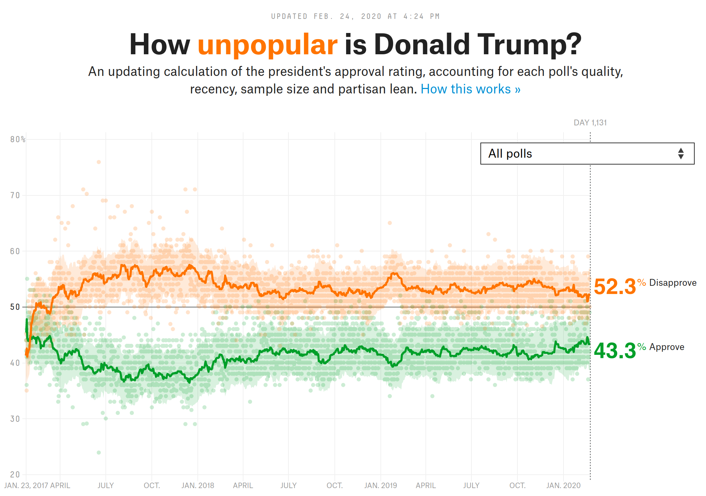
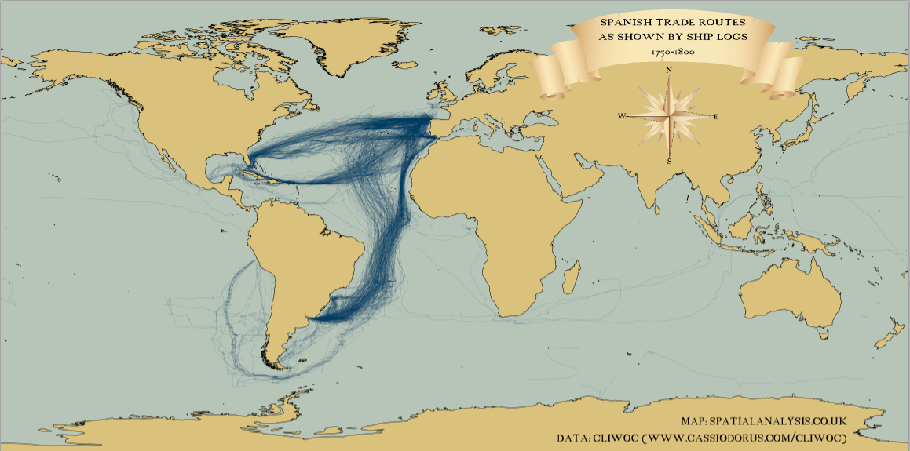
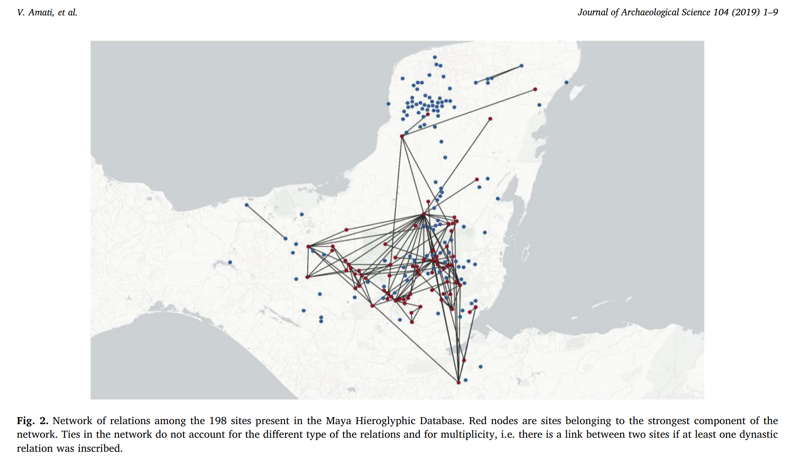

```{r child = "../setup.Rmd"}
```

class: inverse, center, middle, title-slide, animated, slideInDown

# Bienvenides a la Ciencia de Datos <br> `r emo::ji('rocket')`

### 2 de marzo de 2020

---

## hola_mundo()

--

- Pablo Reyes 🧔🏾

--

- Política y AP (2014-2018)

--

- Buendía & Laredo | Lex ++

--

- Programación (JS, Python y R) + estadística

--

- Encuestas
- Seguimiento de actores en medios y redes
- Repositorio legal

--

---
class: inverse, center, middle

### ¡Cuéntenme de ustedes!

¿Cuáles son sus temas de interés?

¿Han usado <i class="fab fa-r-project"></i>?

---

## ¿Por qué Ciencia de Datos?

- Aprenderemos a programar `r emo::ji('computer')`
- Aprenderemos a procesar datos `r emo::ji('wrench')`
- Aprenderemos a analizar `r emo::ji('mag')`
- Aprenderemos a comunicar `r emo::ji('bar_chart')`

Todo esto, mientras usamos <i class="fab fa-r-project"></i> (y otras herramientas).

---
layout: true

## ¿Qué esperar de este curso?

<div class="footer">
<span>
Ciencia de Datos en R `r emo::ji('rocket')` Todo el material está disponible en <a href="https://github.com/pablorm296/CursoR">GitHub</a>
</span>
</div> 

---

--

Este es un curso introductorio a la ciencia de datos con un ligero énfasis en temas de ciencia política e inferencia estadística.

--

**¿Necesito saber estadística o programación?**

--

No. Todos partiremos "desde cero".

--

**¿Este es un curso de metodología cuanti / estadística?**

--

No. Cuando lleguemos a la Unidad II, trabajaremos frecuentemente con temas de estadística (inferencia y modelado). Sin embargo, no nos detendremos en todos sus resquicios teóricos. Piénsenlo como un repaso / introducción general.

---

**¿Donde puedo leer más sobre métodos cuantis / estadística?**

--

Alan Agresti y Barbara Finlay, _Statistical Methods for the Social Sciences_ y otros documentos citados en README.md (más sobre esto al rato).

--

**¿Por qué** <i class="fab fa-r-project"></i>**?**

--

- Abierto y gratuito (SPSS: +1000 USD/año, STATA: +900 USD/año)

--

- Hecho a la medida de un científico (<i class="fab fa-python"></i>)

--

- `ggplot2`: Una de las mejores herramientas para la visualización de datos

---
layout: true
  
<div class="footer">
<span>
Ciencia de Datos en R `r emo::ji('rocket')` Todo el material está disponible en <a href="https://github.com/pablorm296/CursoR">GitHub</a>
</span>
</div> 

---

class: inverse, center, middle

### Para que se den un quemón...

---

## Nate Silver's 538 (Popularidad de Donald Trump)

.pull-left[
Regresión Local Polinomial para estimar una línea de tendencia: `ggplot2` + `loess()`

_Original_: R + JavaScript

[How unpopular is Donald Trump](https://projects.fivethirtyeight.com/trump-approval-ratings)
]

.pull-right[
```{r, echo=FALSE, out.height='100%', out.width='100%'}

```
]

---

##  Spatia.ly (Bitácoras de viaje españolas del S. XVIII)

.pull-left[

Representación de datos georeferenciados: `ggplot2`

_Original_: R

[Mapping historic tracks](https://spatial.ly/2016/10/mapping-historic-tracks-ggplot2/)
]

.pull-right[
```{r, echo=FALSE, out.height='100%', out.width='100%'}

```
]

---

## Análisis de redes para explicar difusión de rituales mayas

.pull-left[

Algo más académico... análisis y visualización de redes: `ggplot2` + `eha` + `tidygraph` 

_Original_: R

]

.pull-right[
```{r, echo=FALSE, out.height='100%', out.width='100%'}

```
]

---

## La comunidad: 

##### R-Ladies

> As a diversity initiative, the mission of R-Ladies is to **achieve proportionate representation by encouraging, inspiring, and empowering people of genders currently underrepresented in the R community**...

##### CRAN

> 15 324 paquetes disponibles