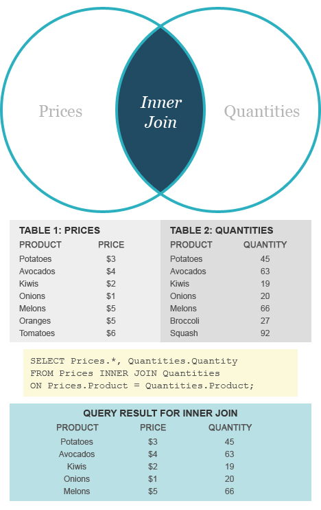

```{r child = "../setup.Rmd"}
```

class: inverse, center, middle, title-slide, animated, slideInDown

# L03: Introducción a la visualización de datos <br> `r paste(emo::ji('mexico'), emo::ji('us'))`

.subtitle[¿Cómo votan los países en la ONU?]

### 2 de marzo de 2020

---
class: inverse, center, middle, center, middle

## Demos un paseo por RStudio

---
class: center, middle

## La interfaz gráfica

---

## La consola

* En la consola podemos escribir código y ver lo que hemos ejecutado con anterioridad
* R es un lenguaje funcional: resolvemos problemas aplicando funciones a nuestros objetos.

```r
#Funciones
funcion(parametros)
verbo(con_esto)
```

--

```r
# Ejemplos
paste("Hola", "mundo")
getRversions()

```

---

## La consola

* R tiene un conjunto de operadores básicos (funciones primitivas)

--

##### Aritméticos

--

```r
2 + 3 * 4 / 5
20 %/% 3 # División de enteros
20 %% 3 # Residuales
2^2 # Potencias
```
--

##### Comparadores

--

```r
2 == 2
3 > 2; 3 >= 2
2 < 3; 2 <= 3
```

---

## La consola

* R tiene un conjunto de operadores básicos (funciones primitivas)

--

##### Series

--

```r
1:10
```

---

## La consola

* En R podemos guardar objetos en el contexto (_environment_) usando unos operadores básicos "especiales".

.center[
`<-` `=` `->`
]

--

```r
y <- 10
x <- 50 + 50
y -> 30 + 30
z = "Hola Mundo!"
#Inspeccionar
y
x
#Limpiar
rm("x")
rm(list = ls())
```

---

## La consola

* Ahora pueden aplicar funciones a esos objetos

> Apliquen la función `print()` al objeto `z`

--

```r
print(x)
```

---

## El editor de texto

* Podemos escribir código en el editor de texto y ejecutarlo en la consola con **Ctr + Enter**.

* Podemos agregar comentarios a nuestro código con el símbolo de gato (#).

* Por default, en el editor de texto podemos escribir **scripts**, que son archivos de texto con la terminación `.R`

---
class: center, middle

## Básicos de <i class="fab fa-github"></i> y <i class="fab fa-git"></i> en RStudio
---

## Usar git en Rstudio

* Inicien un nuevo proyecto, pero ésta vez seleccionen "from Git Repo"
* Ingresen esta dirección en el cuadro de texto: https://github.com/pablorm296/CursoR
* Esto hará que git **clone** el **repositorio** en su proyecto.

---

## El lenguaje git

Vocabulario:
* Repositorio <i class="far fa-box-open"></i> : (__repository__) Conjunto de archivos que deseamos controlar con git.
* Clonar <i class="far fa-clone"></i> : (__git clone__) Crea una copia exacta del repositorio especificado.

---

## Nos presentamos con git

```sh
git config --global user.name 'pablorm296'
git config --global user.email 'pablo.reyes.moctezuma@gmail.com'
git config --global --list
```

---

## Ahora podemos hacer cambios en el repositorio!

> Crea un nuevo script de R
>
> Asigna `"tu nombre"` a un objeto que se llame `miNombre`
> 
> Guarda el archivo en gitTestArea/{tuNúmCredencial}.R

* Vamos a enviarlos a gitHub

---

## El lenguaje git

Vocabulario:
* Comparar <i class="far fa-file-alt"></i> : (__git diff__) Compara, línea por línea, las modificaciones a un archivo.
* Registrar <i class="far fa-file-check"></i> : (__git commit__) Registramos las modificaciones.
* Enviar <i class="far fa-arrow-alt-up"></i> : (__git push__) Enviamos las modificaciones.
* Actualizar <i class="far fa-arrow-alt-down"></i> : (__git pull__) Descargamos la última versión del repositorio.

---
class: center, middle

## <i class="fab fa-markdown"></i> en RStudio

---

## Les presento a R Markdown

* En el explorador de archivos, vayan a handouts/U01_L003/ejemplo.Rmd
* Compilen el archivo usando el botón de _Knit_ (`Ctr + Shift + K`).

---

## ¿Qué es R Markdown?

* Una súper herramienta para pasar directamente de <i class="fab fa-r-project"></i> a <i class="far fa-file-pdf"></i>, <i class="far fa-file-code"></i>, <i class="far fa-file-word"></i>.
* R Markdown es un **lenguaje marcado** (_markup language_, en inglés).
* Recomiendo usarlo para tomar apuntes. Aquí haremos todo lo demás.

---
class: center, middle

## Rápida intruducción a <i class="fab fa-markdown"></i>.

---
class: center, middle

## Ahora sí, abŕochense los cinturones.

---
class: center, middle

# Análisis exploratorio en <i class="fab fa-r-project"></i>.

---

## Análisis exploratorio

* Lo primero que debemos hacer en un análisis es explorar nuestros datos y conocerlos
* Estructura y primeros patrones
* Normalmento esto se hace visualmente

---

## Visualización de datos

.important[
Creación y estudio de la representación visual de un conjunto de datos.
]

* En R hay más de un método/sistema para visualizar datos. Nosotros aprenderemos a hacerlo en `ggplot2` (_state of the art_ en data viz).

---

## ggplot2

.pull-left[
 
]

.pull-right[
* `ggplot2` es la librería (paquete) para visualizar datos de el `tidyverse`.
* El `tidyverse` es una colección de librerías que comparten una filosofía, diseño y sintaxis similar para el análisis de datos en <i class="fab fa-r-project"></i>.
* `ggplot2` es una implementación de _The Grammar of Graphics_ (Leland Wilkinson), un libro que introduce una de las primeras terminologías para la representación visual de datos.
]

---

## Grammar of Graphics

.center[
 
]

---

class: center, middle

# Nuestro primer gráfico

---

## Nuestro primer gráfico

* En el explorador de archivos, vayan a handouts/U01_L003/paisesONU.Rmd

---

## Instalar y cargar paquetes

* En R, un paquete es un conjunto de funciones, documentación, ejemplos y datos.

--

* Usamos `install.packages()` para instalarlos (guardarlos en el disco duro).

--

* Una vez instalados, tenemos que cargarlos en memoria para que las funciones estén disponibles. 

--

* Usamos `library()` para cargarlos.

---

## Instalar y cargar paquetes

* En este ejercicio, usamos tres paquetes: `tidyverse`, `unvotes` y `lubridate`.

--

* `tidyverse` es un _umbrella package_ que, en realidad, contiene 8 paquetes (`ggplot2`, `dplyr`, `readr`, entre otros).

* `unvotes` es un paquete que contiene __datos__: Registro de votos en la Asamblea General de la ONU desde su fundación.

* `lubridate` es un paquete con un montón de funciones útiles para trabajar con datos en forma de fechas y marcas temporales.

--

.instruction[
Instala y carga los paquetes necesarios, llenando los _chunks_ en blanco que están en el markdown.
]

---

## Instalar y cargar paquetes

```{r tidyverse}
library(tidyverse)
```

---

## Instalar y cargar paquetes

```{r unvotes}
library(unvotes)
```

---

## Instalar y cargar paquetes

```{r load_lubridate}
library(lubridate)
```

---

## Un primer vistazo a los datos

* En el paquete `unvotes` hay tres conjuntos de datos: `un_vote`, `un_roll_calls`, `un_roll_call_issues`. 
* Podemos echar un primer vistazo a los datos escribiendo el nombre del conjunto que queremos explorar en la consola.

```{r consoledata}
un_votes
```

---

## Un primer vistazo a los datos

* En R, el operador `$` nos permite acceder a la columna de una tabla.

```{r dollarsign}
#Columna rci
un_votes$rcid
```

---

## Un primer vistazo a los datos

* También podemos usar el explorador incluido en RStudio

---

## Un primer vistazo a los datos

* En R, por lo general trabajaremos con datos __tabulares__.

--

* Una fila = una observación. Una columna = una variable/propiedad de la observación.

* Todas las observaciones comparten las mismas propiedades.

---

## Un primer vistazo a los datos

* No siempre usaremos la consolar o el explorador de RStudio para conocer nuestros datos: no es lo más eficiente del mundo.

---

## Un primer vistazo a los datos

* Podemos usar `head` para obtener las primeras observaciones de una tabla.

```{r head_unvotes}
head(un_votes, n = 5)
```

---

## Un primer vistazo a los datos

* Podemos usar `tail` para obtener las últimas observaciones de una tabla.

```{r tail_unvotes}
tail(un_votes, n = 5)
```

---

## Un primer vistazo a los datos

* Podemos usar `str` (abreviación de __structure__) para obtener información sobre las columnas de la tabla.

```{r str_unvotes}
str(un_votes)
```

---

## Un primer vistazo a los datos

* Podemos usar `summary` para obtener un resumen estadístico de la tabla

```{r summary_unvotes}
summary(un_votes)
```

---

## Un primer vistazo a los datos

.instruction[
¿Qué datos hay en `un_votes`, `un_roll_calls` y `un_roll_call_issues`?

¿Qué es cada fila?
]

---

## Manipulando los datos

* Necesitamos juntar `un_votes`, `un_roll_calls` y `un_roll_call_issues` en una sola tabla.
* El paquete `dplyr` tiene la función `inner_join` que nos permite hacer esto.
* `inner_join` buscará **información (propiedades) que comparten los datos en las tablas**

---

## Manipulando los datos

.center[
 
]

---

## Manipulando los datos

.instruction[
¿Qué dato/propiedad tienen en común las tablas?
]

---

## Manipulando los datos

* `inner_join` toma los siguientes argumentos: `x`, `y` (tablas) y `by`, nombre de la columna que tienen en común las tablas.
* ¿Cómo podemos saber esto? usen `?` para obtener ayuda de una función: `?inner_join`.

.instruction[
¿Cómo unimos `un_votes` y `un_roll_calls`?
]

---

## Manipulando los datos

```{r juntar_tablas_1}
un_votes_complete <- inner_join(x = un_votes, y = un_roll_calls, by = "rcid")
```

--

```{r juntar_tablas_2}
un_votes_complete <- inner_join(x = un_votes_complete, y = un_roll_call_issues, by = "rcid")
```

---

## Manipulando los datos

* En R podemos escribir eso de manera un poco más elegante usando una `pipe` con el operador `%>%`.

 

---

## Manipulando los datos

* Usando la `pipe`, **podemos mandar el resultado del último comando como primer argumento del siguiente comando**.

```{r}
"hola" %>%
  print()
```

---
## Manipulando los datos

```{r juntar_tablas_pipe}
un_votes_complete <- un_votes %>%
  inner_join(y = un_roll_calls, by = "rcid") %>%
  inner_join(y = un_roll_call_issues, by = "rcid")
```

---

## El primer gráfico

```{r echo=FALSE}
un_votes_complete %>% 
  filter(country %in% c("United States of America", "United Kingdom of Great Britain and Northern Ireland")) %>%
  group_by(country, year = year(date), issue) %>%
  summarize(
    votes = n(),
    percent_yes = mean(vote == "yes") * 100
  ) %>%
  ggplot(mapping = aes(x = year, y = percent_yes, color = country)) +
  geom_point() +
  geom_smooth(method = "loess", se = FALSE) +
  facet_wrap( ~ issue) +
  labs(
    title = "Percentage of 'Yes' votes in the UN General Assembly",
    subtitle = "Key issues (1946 to 2015)",
    y = "% Yes",
    x = "Year",
    color = "Country"
  )
```

---

## El primer gráfico

.instruction[
Cambien el Reino Unido por un país que les interese.
]

---

## Filtrar, agrupar y resumir

* En el markdown seguro notaron las funciones `filter`, `group_by` y `summarize`

---

## Filtrar, agrupar y resumir

* `filter` nos sirve para **seleccionar filas** con base en una condición. En el markdown, le pedimos a `filter` que seleccionara las filas cuyo valor coincidiera con una lista de opciones.

```r
filter(country %in% c("United States of America", "United Kingdom of Great Britain and Northern Ireland"))
```
--

* `c` es una abreviación de **concatenate**. La función `c` crea un vector (una lista) de elementos. En nuestro caso, creo una lista con "United States of America" y "United Kingdom of Great Britain and Northern Ireland".

---

## Filtrar, agrupar y resumir

.instruction[
Crea tres versiones de `un_votes_complete`. Una en donde selecciones todos los votos importantes para el departamento de estado, otra con sólo votos después de la disolución de la URSS y otra con todos los votos cuyo tema es derechos humanos ("HUman rights").

Tips: recuerda los operadores básicos en R!
]

---

## Filtrar, agrupar y resumir

* `group_by` nos sirve para separar la información en grupos. Los grupos se definen por una o más variables.

```r
group_by(country, year = year(date), issue)
```

--

* La función `year` nos permite extraer el año de una fecha. 01/01/2020 = 2020; 07/11/1917 = 1917. 

---

## Filtrar, agrupar y resumir

 

---

## Filtrar, agrupar y resumir

.instruction[
Agrupa cada una de las tres versiones de `un_votes_complete` por país, __sesión__ y tema
]

---

## Filtrar, agrupar y resumir

* `summarize` nos sirve para calcular estadística descriptiva a partir de los grupos en una tabla.

```r
summarize(
    votes = n(),
    percent_yes = mean(vote == "yes") * 100
  )
```
--

* `n` es una función que cuenta el número de filas y `mean` calcula la media. En una variable categórica, calcular la media es lo mismo que contar la proporción (contar el número de "yes" y dividirlo entre el total de observaciones).

---

## Filtrar, agrupar y resumir

.instruction[
¿De qué otra manera podemos calcular percent_yes usando la función `n`? Tip: tiene que ver con el uso de operadores básicos.

Con summarize crea una variable `percent_amend` (en `un_votes_complete`) en la que guardes el **porcentaje de enmiendas**. 

Con summarize crea una variable `percent_abstain` (en `un_votes_complete`) en la que guardes el **porcentaje de abstenciones**. 
]

---

## Desmenuzando ggplot2

.center[
 
]

---

## Desmenuzando ggplot2

* Antes de continuar. Ustedes perdonarán los anglicismos que se vienen en esta sección. Las distinciones semánticas que se hacen en los trabajos originales (publicados en el inglés) son muy sutiles. Desafortunadamente, aún no contamos con (muchas) traducciones o un esfuerzo parecido por crear un vocabulario para la visualización de datos.
* La idea es simple. **Un _plot_ es un objeto que especificamos a partir de uno o más conjuntos datos y que podemos modificar agregando capas**.
* Una capa, generalmente, **añade o modifica la información visual representada** en un _plot_.
* _plot_  !=  _graph_  !=  _graphic_  !=  _chart_. 

---

## Desmenuzando ggplot2

* Siempre empezamos inicializando un objeto `ggplot` con la función `ggplot`. Por lo general, siempre especifiamos los datos que vamos a usar.

--

```{r}
#Filtrar la tabla
un_votes_filtered <- un_votes_complete %>%
  filter(country %in% c("United States of America", "Mexico")) %>%
  group_by(country, year = year(date), issue) %>%
  summarize(
    votes = n(),
    percent_yes = mean(vote == "yes") * 100)

# Inicializar el objeto
mi_plot <- ggplot(data = un_votes_filtered)
```

---

## Desmenuzando ggplot2

* Después de inicializar el objeto `ggplot`, podemos empezar a agregar formas (_geometries_) y especificar mapeos estéticos (_aesthetics_).
* Un mapeo estético consiste en decirle a `ggplot2` que **asocie una variable con alguna característica estética de la forma**.
* Por ejemplo, si usamos `geom_point(aes(x = year, y = percent_yes))`, le estamos diciendo que la posición de cada punto en el plano cartesiando va a estar dada por las variables `year` y `percent_yes`.

--

```{r}
mi_plot <- ggplot(data = un_votes_filtered) +
  geom_point(aes(x = year, y = percent_yes))
```

---

## Desmenuzando ggplot2

* Si agregamos `colour = country`, le vamos a decir a `ggplot2` que asocie el color de cada punto a la variable `country`.

--

* Nota que `ggplot2` agrega automáticamente las leyendas (ve los ejes y los puntos con colores).

```{r}
mi_plot <- ggplot(data = un_votes_filtered) +
  geom_point(aes(x = year, y = percent_yes, colour = country))
```

---

## Desmenuzando ggplot2

* Toma en cuenta que no todos las formas y mapeos estéticos son compatibles.
 
.instruction[
Intenta usar `geom_bar` o `geom_area` en lugar de `geom_point`.
]

--

* ¡Siempre vean la documentación (https://ggplot2.tidyverse.org/reference/index.html) o la hoja de referencia rápida (https://rstudio.com/wp-content/uploads/2015/03/ggplot2-cheatsheet.pdf)!

```{r}
mi_plot <- ggplot(data = un_votes_filtered) +
  geom_bar(aes(x = year, y = percent_yes, colour = country))
```

---

## Desmenuzando ggplot2

* `ggplot` tiene unas figuras (_geometries_) especiales que no trabajan directamente sobre los datos que le proporcionamos, sino sobre el resultado de algún cálculo estadístico (_stats_).
* Una de ellas es `geom_smooth`, que agrega una línea de tendencia (obtenida por algún método de medias condicionadas... un término _fancy_ para decir "regresión").

---

## Desmenuzando ggplot2

* Con el parámetro `method` controlamos el tipo de regresión. En este caso, `loess`: _locally estimated scatterplot smoothing_.
* Con el parámetro `se` le decimos a `ggplot` si queremos dibujar los intervalos de confianza.

```{r}
mi_plot <- ggplot(data = un_votes_filtered) +
  geom_point(aes(x = year, y = percent_yes, colour = country)) + 
  geom_smooth(aes(x = year, y = percent_yes, colour = country), method = "loess", se = F)
```

---

## Desmenuzando ggplot2

* Otra de estas funciones especiales es `geom_histogram` y `geom_density`. El primero calcula la frecuencia de un número determinado de intervalos en los datos (histograma), mientras que el segundo dibuja la densidad de probabilidad de la variable (curva de densidad).

--

```{r}
mi_plot <- ggplot(data = un_votes_filtered) +
  geom_histogram(aes(x = year), bins = 20)
```

---

## Desmenuzando ggplot2

* Una _facet_, divide el _plot_ en _subplots_ con base en una variable de los datos.
* Cuando usamos _facets_, **usaremos la notación de fórmula**. En R, marcamos fórmulas con una `~` (tilde). Todo lo que está a la derecha son variables explicativas, mientras todo lo que está a la izquierda son variables dependientes. **En el caso de _facets_, todo lo que está a la derecha son filas y todo lo que está a la izquierda son columnas.**

--

```{r}
mi_plot <- ggplot(data = un_votes_filtered) +
  geom_point(aes(x = year, y = percent_yes, colour = country)) + 
  geom_smooth(aes(x = year, y = percent_yes, colour = country), method = "loess", se = F) +
  facet_wrap( ~ issue)
```

---

## Desmenuzando ggplot2

* Con `labs`, podemos especificar título, subtítulo, leyendas y pies de gráfica.

--

```{r}
mi_plot <- ggplot(data = un_votes_filtered) +
  geom_point(aes(x = year, y = percent_yes, colour = country)) + 
  geom_smooth(aes(x = year, y = percent_yes, colour = country), method = "loess", se = F) +
  facet_wrap( ~ issue) +
  labs(x = "Año", y = "Porcentajes de votos a favor", colour = "País", 
       title = "¿Cómo votan México y los EE.UU en la Asamblea General de la ONU?",
       subtitle = "Votaciones sobre resoluciones en seis temas claves",
       caption = "Con datos de Erik Voeten \"Data and Analyses of Voting in the UN General Assembly\", 2013")
```

---

## Desmenuzando ggplot2

* Con `theme_xx`, podemos agregar un tema predefinido.

--

```{r}
mi_plot <- ggplot(data = un_votes_filtered) +
  geom_point(aes(x = year, y = percent_yes, colour = country)) + 
  geom_smooth(aes(x = year, y = percent_yes, colour = country), method = "loess", se = F) +
  facet_wrap( ~ issue) +
  labs(x = "Año", y = "Porcentajes de votos a favor", colour = "País", 
       title = "¿Cómo votan México y los EE.UU en la Asamblea General de la ONU?",
       subtitle = "Votaciones sobre resoluciones en seis temas claves",
       caption = "Con datos de Erik Voeten \"Data and Analyses of Voting in the UN General Assembly\", 2013") +
  theme_dark()
```

---

## Desmenuzando ggplot2

* Con `theme_xx`, podemos agregar un tema predefinido.

--

```{r}
mi_plot <- ggplot(data = un_votes_filtered) +
  geom_point(aes(x = year, y = percent_yes, colour = country)) + 
  geom_smooth(aes(x = year, y = percent_yes, colour = country), method = "loess", se = F) +
  facet_wrap( ~ issue) +
  labs(x = "Año", y = "Porcentajes de votos a favor", colour = "País", 
       title = "¿Cómo votan México y los EE.UU en la Asamblea General de la ONU?",
       subtitle = "Votaciones sobre resoluciones en seis temas claves",
       caption = "Con datos de Erik Voeten \"Data and Analyses of Voting in the UN General Assembly\", 2013") +
  theme_light()
```
