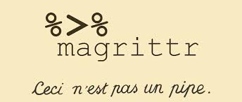
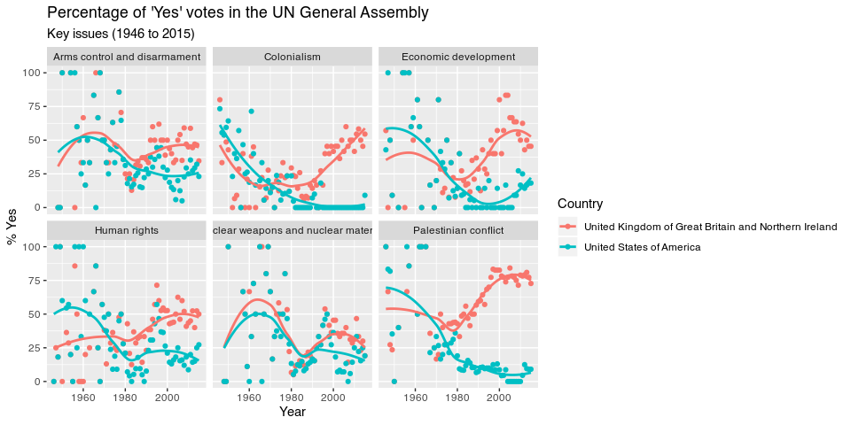

```{r child = "../setup.Rmd"}
```

class: inverse, center, middle, title-slide, animated, slideInDown

# L03: Introducción a la visualización de datos <br> `r paste(emo::ji('mexico'), emo::ji('us'))`

.subtitle[¿Cómo votan los países en la ONU?]

### 2 de marzo de 2020

---
class: inverse, center, middle, center, middle

## Demos un paseo por RStudio

---
class: center, middle

## La interfaz gráfica

---

## La consola

* En la consola podemos escribir código y ver lo que hemos ejecutado con anterioridad
* R es un lenguaje funcional: resolvemos problemas aplicando funciones a nuestros objetos.

```r
#Funciones
funcion(parametros)
verbo(con_esto)
```

--

```r
# Ejemplos
paste("Hola", "mundo")
getRversions()

```

---

## La consola

* R tiene un conjunto de operadores básicos (funciones primitivas)

--

##### Aritméticos

--

```r
2 + 3 * 4 / 5
20 %/% 3 # División de enteros
20 %% 3 # Residuales
2^2 # Potencias
```
--

##### Comparadores

--

```r
2 == 2
3 > 2; 3 >= 2
2 < 3; 2 <= 3
```

---

## La consola

* R tiene un conjunto de operadores básicos (funciones primitivas)

--

##### Series

--

```r
1:10
```

---

## La consola

* En R podemos guardar objetos en el contexto (_environment_) usando unos operadores básicos "especiales".

.center[
`<-` `=` `->`
]

--

```r
y <- 10
x <- 50 + 50
y -> 30 + 30
z = "Hola Mundo!"
#Inspeccionar
y
x
#Limpiar
rm("x")
rm(list = ls())
```

---

## La consola

* Ahora pueden aplicar funciones a esos objetos

> Apliquen la función `print()` al objeto `z`

--

```r
print(x)
```

---

## El editor de texto

* Podemos escribir código en el editor de texto y ejecutarlo en la consola con **Ctr + Enter**.

* Podemos agregar comentarios a nuestro código con el símbolo de gato (#).

* Por default, en el editor de texto podemos escribir **scripts**, que son archivos de texto con la terminación `.R`

---
class: center, middle

## Básicos de <i class="fab fa-github"></i> y <i class="fab fa-git"></i> en RStudio
---

## Usar git en Rstudio

* Inicien un nuevo proyecto, pero ésta vez seleccionen "from Git Repo"
* Ingresen esta dirección en el cuadro de texto: https://github.com/pablorm296/CursoR
* Esto hará que git **clone** el **repositorio** en su proyecto.

---

## El lenguaje git

Vocabulario:
* Repositorio <i class="far fa-box-open"></i> : (__repository__) Conjunto de archivos que deseamos controlar con git.
* Clonar <i class="far fa-clone"></i> : (__git clone__) Crea una copia exacta del repositorio especificado.

---

## Nos presentamos con git

```sh
git config --global user.name 'pablorm296'
git config --global user.email 'pablo.reyes.moctezuma@gmail.com'
git config --global --list
```

---

## Ahora podemos hacer cambios en el repositorio!

> Crea un nuevo script de R
>
> Asigna `"tu nombre"` a un objeto que se llame `miNombre`
> 
> Guarda el archivo en gitTestArea/{tuNúmCredencial}.R

* Vamos a enviarlos a gitHub

---

## El lenguaje git

Vocabulario:
* Comparar <i class="far fa-file-alt"></i> : (__git diff__) Compara, línea por línea, las modificaciones a un archivo.
* Registrar <i class="far fa-file-check"></i> : (__git commit__) Registramos las modificaciones.
* Enviar <i class="far fa-arrow-alt-up"></i> : (__git push__) Enviamos las modificaciones.
* Actualizar <i class="far fa-arrow-alt-down"></i> : (__git pull__) Descargamos la última versión del repositorio.

---
class: center, middle

## <i class="fab fa-markdown"></i> en RStudio

---

## Les presento a R Markdown

* En el explorador de archivos, vayan a handouts/U01_L003/ejemplo.Rmd
* Compilen el archivo usando el botón de _Knit_ (`Ctr + Shift + K`).

---

## ¿Qué es R Markdown?

* Una súper herramienta para pasar directamente de <i class="fab fa-r-project"></i> a <i class="far fa-file-pdf"></i>, <i class="far fa-file-code"></i>, <i class="far fa-file-word"></i>.
* R Markdown es un **lenguaje marcado** (_markup language_, en inglés).
* Recomiendo usarlo para tomar apuntes. Aquí haremos todo lo demás.

---
class: center, middle

## Rápida intruducción a <i class="fab fa-markdown"></i>.

---
class: center, middle

## Ahora sí, abŕochense los cinturones.

---
class: center, middle

# Análisis exploratorio en <i class="fab fa-r-project"></i>.

---

## Análisis exploratorio

* Lo primero que debemos hacer en un análisis es explorar nuestros datos y conocerlos
* Estructura y primeros patrones
* Normalmento esto se hace visualmente

---

## Visualización de datos

.important[
Creación y estudio de la representación visual de un conjunto de datos.
]

* En R hay más de un método/sistema para visualizar datos. Nosotros aprenderemos a hacerlo en `ggplot2` (_state of the art_ en data viz).

---

## ggplot2

.pull-left[
 
]

.pull-right[
* `ggplot2` es la librería (paquete) para visualizar datos de el `tidyverse`.
* El `tidyverse` es una colección de librerías que comparten una filosofía, diseño y sintaxis similar para el análisis de datos en <i class="fab fa-r-project"></i>.
* `ggplot2` es una implementación de _The Grammar of Graphics_ (Leland Wilkinson), un libro que introduce una de las primeras terminologías para la representación visual de datos.
]

---

## Grammar of Graphics

.center[
 
]

---
class: center, middle

# Nuestro primer gráfico

---

## Nuestro primer gráfico

* En el explorador de archivos, vayan a handouts/U01_L003/paisesONU.Rmd

---
class: center, middle

# Instalar y cargar paquetes en <i class="fab fa-r-project"></i>

---
class: center, middle

 

_Pipe_, en inglés. Se lee "_and then_". Pasa el último objeti como primer argumento de la siguiente función.

---
## Un vistazo a nuestros datos

> ¿Sobre qué es la base de datos?
>
> ¿Cuántas variables hay?
>
> ¿Cuántas observaciones hay?
>
> ¿Qué valores hay en la variable `vote`
>
> ¿Qué valores hay en la variable `issue`

---

## Un vistazo a nuestros datos

```r
summary()
nrow()
ncol()
unique()
```

---
## Nuestro primer gráfico

> ¿Sobre qué es el gráfico?
>
> ¿Cuántas variables están representadas en el gráfico?
>
> ¿Qué variables están representadas en qué __aesthetics__?
>
> ¿Qué objetos geométricos (__goeometries__) se usan para representar los datos?

---

.center[
 
]

---
## Nuestro primer gráfico

> ¿Cómo creen que vota México y EEUU?
>
> ¿Votan igual?

---
## Nuestro primer gráfico

> Eligan EEUU y otro país.

---
class: center, middle

## Pintemos poco a poco

Datos -> Mapeo -> Geometrías

---

## Mapeo

* _Aesthetics_
  * Ejes (x, y)
  * Shape
  * Colour
  * Size
  * Alpha
  
---

## Geometrías

* geom_
  * point
  * line
  * column
  * smooth
  * ...
  


